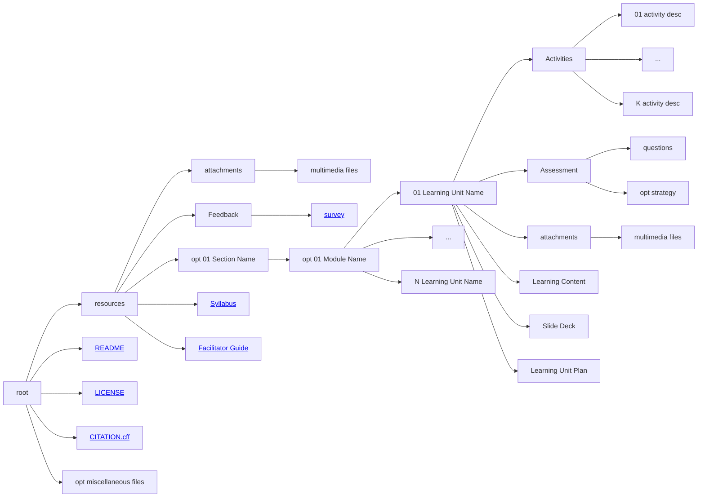

# Stage 3 - Design

!!! quote ""

    Design is intelligence made visible - *Alina Wheeler​*

## Time to brainstorm

  

    

      
      
<small class="text-muted">
                Image by <a href="https://pixabay.com/users/geralt-9301/?utm_source=link-attribution&utm_medium=referral&utm_campaign=image&utm_content=3829057">Gerd Altmann</a> from <a href="https://pixabay.com//?utm_source=link-attribution&utm_medium=referral&utm_campaign=image&utm_content=3829057">Pixabay</a> </small>
                

    

    

      

            <h2 class="card-title">Concept map</h2>
            
Build a concept map of your learning materials aligning with the MVS profiles.

            
The aligned MVS profile can help you cristalize the learning objectives using MVS taxonomy.

            
Each MVS profile defines a list of technical and soft skills required for the profile. Think on how to incorporate both aspects in your learning materials.

            <a href="https://fair-by-design-methodology.github.io/MVS/latest/MVS%20Profiles/Civil%20Servant/civil_servant/" class="btn btn-primary stretched-link">Go to MVS profiles catalogue</a>
      

    

  

​
## Structure is everything

- <i class="fa fa-cogs" aria-hidden="true"></i> Create an intuitive logical organisation of all learning materials. 
- <i class="fa fa-cubes" aria-hidden="true"></i> The goal is for other people to easily reuse a single item (plan, activity, unit, assessment, ...).
- <i class="fa fa-sitemap" aria-hidden="true"></i> Use a hierarchical structure to combine learning units into larger compositions.

!!! example "How to organise the files"

    The diagram shows how to organise all files. Click on the links to discover and use pre-prepared templates.

## Develop
Hunter

## Facilitation Guide

## Feedback Form
​

​
Don't worry, we got you covered with templates​

<a href="https://fair-by-design-methodology.github.io/FAIR-by-Design_ToT/latest/Stage%203%20%E2%80%93%20Design/04-Conceptualisation/04-Conceptualisation/" class="btn btn-dark text-white btn-lg btn-block">Start an in-depth training on the Design stage....</a>
<a href="https://fair-by-design-methodology.github.io/FAIR-by-Design_Book/4%20-%20FAIR-by-design%20learning%20materials%20creation/4.1%20-%20Workflow%20stages%20description/413-design/" class="btn btn-dark text-white btn-lg btn-block">FAIR-by-Design Methodology: Design stage....</a>